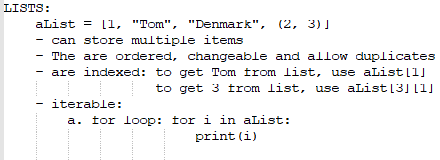
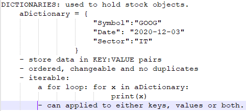

<h1>A simple stock analysis app with 3 modules that illustrate "SEPARATON OF CONCERNS"<h1>

1. A stock module to encapsulate methods and attributes of stock instances.
2. A data retriver module for  data import methods. 
3. Main module to help us use the classes. 
4. Data types used: 
    <ul>
    <li>int: prices can be integers</li>
    <li>float: prices can have decimals</li>
    <li>string: symbol is a string</li>
    </ul>
5. Data structures used: a container for any kind of data.
===================================
    <ul style = "list-style: none;">
    LISTS
    <li></img></li>
    DICTIONARIES
    <li></img></li>
    </ul> 
    <h3>must revise retrieval class</h3>
6. Loops:
7. Conditional statements:
8. UML diagrams go here
</img>
