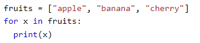
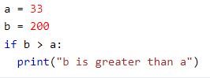

<h1 style = "color:orangered">A simple stock analysis app with 3 modules that illustrate "SEPARATON OF CONCERNS"<h1>

1. 
A stock module to encapsulate methods and attributes of stock instances.

2. 
A data retriver module for  data import methods.
 
3. 
Main module to help us use the classes.
 
4. 
Data types used:
 
    <ul id = "list1">
    <li>int: prices can be integers</li>
    <li>float: prices can have decimals</li>
    <li>string: symbol is a string</li>
    </ul>
5. Data structures used: a container for any kind of data.
    ===================================
    <ul id = "list2">
    LISTS
    <li></img></li>
    DICTIONARIES
    <li></img></li>
    </ul> 

6. Loops: control flow statements. A simple for loop below.
    </img>
7. Conditional statements: criteria based decisions
    </img>
8. UML diagrams go here: a simplified view of an application
    </img>
9. The classes in detail

