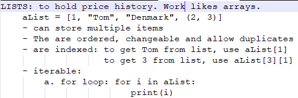
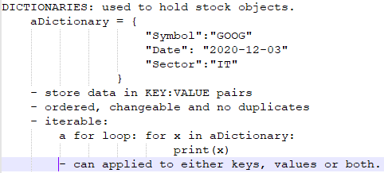
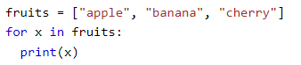
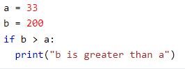

<h1 style = "color:orangered">A simple stock analysis app with 4 modules that illustrate "SEPARATON OF CONCERNS"<h1>

1. 
A stock module to encapsulate methods and attributes of stock instances.

2. 
A data retriver module for  data import methods.
 
3. 
A customers module to use the stock class

3. 
Main module to help us use the classes.
 
5. 
Data types used:
 
    <ul id = "list1">
    <li>int: prices can be integers</li>
    <li>float: prices can have decimals</li>
    <li>string: symbol is a string</li>
    </ul>
6. 
Data structures used: a container for any kind of data.

    ===================================
    <ul id = "list2">
    LISTS
    <li></img></li>
    DICTIONARIES
    <li></img></li>
    </ul> 

7. 
Loops: control flow statements. A simple for loop below.

    </img>
8. 
Conditional statements: criteria based decisions

    </img>
9. 
UML diagrams go here: a simplified overview of an application

    </img>
10. 
The classes in detail

<ul>
<li>data retriever will provide stocks available for sale</li>
<li>customer will aquire the stocks of intereset</li>
<li>stock class will be used to provide insight into each stock</li> 
</ul>

