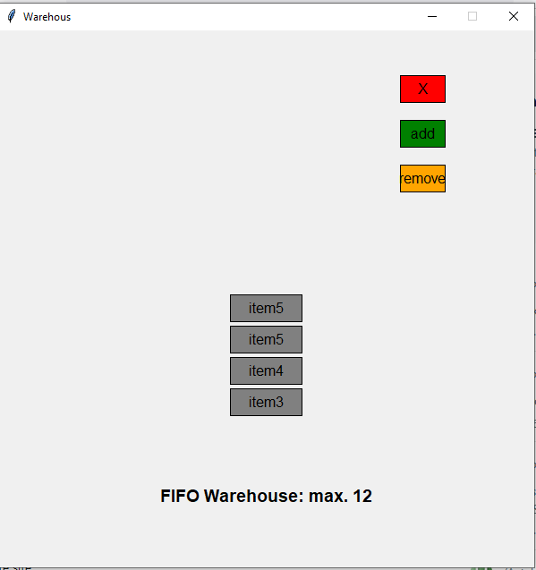

Testing python memory. 

1. Simple classes and instances
    a. create to 2 classes (human, vehicle)
    b. add variables and methods. 
2. Class and object collaboration
    a. test if object from vehicle class can be used in human class. 
        - the relationship is associative. 
3. Inheritance
    a. a singer class then inherits form the human class. 
        - by using super(): parent class attributes and methods can be accessed. 
4. Polymorphism
    - sub class singer differentiating itself from the basic human. 
5. Lists: 
    a. register vehicle instances in vehicle class (car_made =[])
    b. register vehicle instances sold (cars_sold = []) in vehicle class and on human instance who bought them (cars_owned = []). 
    c. register vehicle instances available for sale (cars_inStock = [])
        - if a car exists in cars_sold, it's removed from cars_inStock
    d. register songs by singer instances (songs =[])
6. Class variables
    - the lists mentioned above + int for id
7. Int
    - used to provide a unique id to each vehicle instance and track the number of instances. 
8. Unit testing
     a. ran a simple test on each method in the human class.
        - assertEqual was used
9. Graphics: 
    - gui for HUMAN VS. CAR COMING SOON
    - for now, there's a test in testVisual.py. 
    - Had to brush up on some thing. 
    - simple list display, with append and pop() visualized. 
    - must add input window to remove specific item from list.
    </img> 
    

[def]: arehours